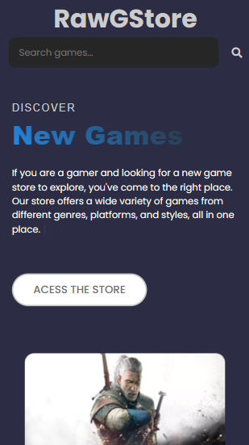
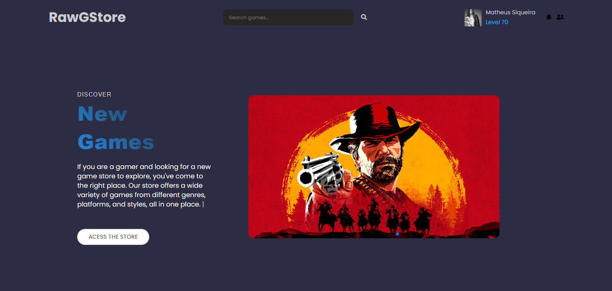

# RawGStore
|      MOBILE         |          DESKTOP       |
|:-------------------:|:-----------------------:
|||
|                     |                        |

[Clique aqui](https://rawgstore-siqueira.vercel.app/) para acessar o site!

## **Sobre** 

Projeto com o objetivo de desenvolver uma plataforma web para listar e visualizar jogos disponiveis dentro da API RAWG. Para construir este projeto, foi utilizado o javascript puro. Todos os dados foram obtidos através do uso da API REST [RAWG](https://api.rawg.io/docs/)

Este desafio foi proposto colocar em prática os conhecimentos adquiridos no curso do [Senai Jandira](https://jandira.sp.senai.br/) na criação de web sites.

---

## **Relatório de Experiência** 
Sobre o consumo da API foi muito fácil de integrar com a minha ideia, meu único e mais desafiados problema, foi a questão da utilização das ROTAS, ou seja, uma aplicação SPA (Single Page Application) sem paginas HTML e sim páginas criadas através do JavaScript.
---

## **Tecnologias utilizadas**
- HTML
- CSS
- JavaScript
- Markdown
- Responsividade
- Rest Api
- Routes
- Web Components

---

##  **Ferramentas**
- Figma
- GitHub
- Font Awesome
- Visual Studio Code

---
## **Critérios**
- [x]  Documentou problemas, se encontrado, para futuras consultas?
- [x]  Foi criado o layout no figma?
- [x]  A página foi construída seguindo o planejado no Figma?
- [x]  A página funciona em dispositivos diferentes?
- [x]  Foi consumida a API escolhida?
- [x]  Foi criado web componentes?
- [x]  Foi criado um padrão de roteamente para as paginas?
- [x]  As funções foram criadas seguindo à boa prática de responsabilidade única?
- [x]  Quando possível, foi criado funções puras?
- [x]  O projeto está publicado?
- [x]  Foi criado o arquivo README.md?

---
## **Autor**
- [Matheus Siqueira](https://github.com/ma7hs)  